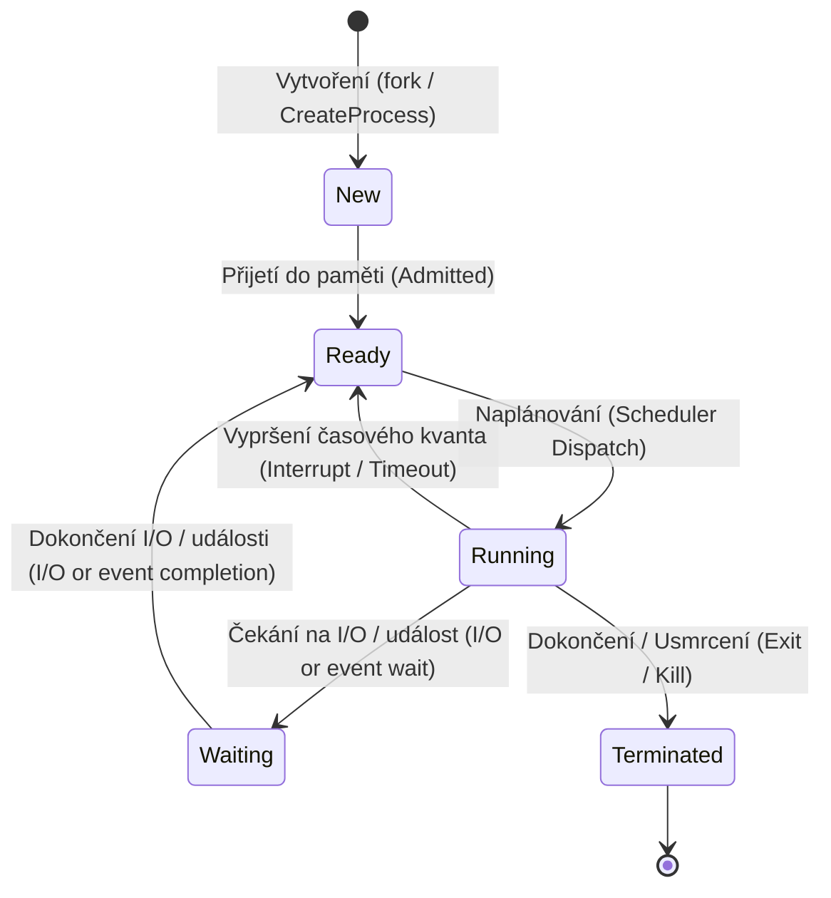

# 1. Správa uživatelů, procesů a služeb v operačních systémech

## Architektura uživatelů a uživatelských skupin
V inženýrství operačních systémů představuje **uživatel** základní bezpečnostní identitu (Security Principal), pod kterou jsou v systému vykonávány instrukce a spouštěny procesy. Každý uživatel má přiřazeno striktní oprávnění a vlastní izolované datové prostředí (profil). **Uživatelská skupina** je pak logický kontejner pro agregaci více uživatelů. Smyslem skupin je drastické zjednodušení administrace – oprávnění k souborům nebo spouštění aplikací (často přes přístupové matice DAC – Discretionary Access Control) se z důvodu škálovatelnosti nepřiřazuje individuálním uživatelům, nýbrž celé skupině (např. *Administrators* nebo *Developers*).

### Správa v OS Windows
Windows identifikuje uživatele i skupiny pomocí unikátního identifikátoru **SID (Security Identifier)** (nikoliv podle jména). Lokální účty jsou bezpečně uchovávány v hashované SAM databázi (Security Account Manager). V podnikovém prostředí je pak správa centralizována pomocí distribuované databáze Active Directory (AD).
- **GUI rozhraní**: Klasický nástroj `lusrmgr.msc` (Místní uživatelé a skupiny) nebo moderní `netplwiz`.
- **Terminálová správa (Příklady)**:
  - Výpis všech uživatelů: `net user`
  - Výpis všech skupin: `net localgroup`
  - Založení uživatele: `net user Jan heslo123 /add`
  - Vytvoření lokální skupiny: `net localgroup Vyvojari /add`
  - Přidání uživatele do skupiny: `net localgroup Vyvojari Jan /add`

### Správa v OS Linux
Linux identifikuje uživatele pomocí celočíselného **UID (User ID)** a skupiny pomocí **GID (Group ID)**. Záznamy o uživatelích leží v čitelném textovém souboru `/etc/passwd` (obsahuje UID, domovský adresář, výchozí shell). Záznamy o skupinách jsou v `/etc/group` (obsahuje názvy skupin, GID a seznam členů). Kryptografické hashe hesel (typicky chráněné algoritmem SHA-512) se nacházejí ve striktně chráněném souboru `/etc/shadow` přístupném pouze pro root uživatele. Každý proces v Linuxu vždy nese UID uživatele, který ho spustil (tzv. RUID a EUID - Real / Effective User ID).
- **Terminálová správa (Příklady)**:
  - Výpis všech uživatelů: `cat /etc/passwd`
  - Výpis všech skupin: `cat /etc/group`
  - Vytvoření nové skupiny: `sudo groupadd vyvojari`
  - Založení uživatele s vytvořením domovské složky (`-m`) a přímým přidáním do sekundární skupiny *sudo* (`-G`): `useradd -m -G sudo jan`
  - Přidání existujícího uživatele do skupiny: `sudo usermod -aG vyvojari jan` (přepínač `-a` značí append a je klíčový pro zachování stávajících skupin uživatele)
  - Změna hesla: `passwd jan`
  - Smazání uživatele včetně jeho dat v home adresáři: `userdel -r jan`

## Program vs. Proces a jeho životní cyklus
Je kriticky důležité rozlišovat mezi programem a procesem. **Program** je čistě pasivní entita – neaktivní soubor uložený na nevolatilním paměťovém médiu (např. kompilovaná binárka na pevném disku). Naproti tomu **Proces** je aktivní, dynamická instance běžícího programu. Když OS spustí program, alokuje mu virtuální paměť v RAM (obsahující zásobník/stack, haldu/heap, datový segment a strojový kód/text segment), přidělí mu unikátní celočíselný identifikátor **PID (Process ID)** a procesorový plánovač (Scheduler) mu začne přidělovat časová okna (Time Slices) pro vykonávání instrukcí v CPU. Data o aktuálním stavu procesu uchovává jádro v tabulce zvané **PCB (Process Control Block)**.

- **Vznik procesu v OS (akademický rozdíl)**:
  - **Linux (Unix)**: Využívá dvoukrokový mechanismus: `fork()` (vytvoří identickou kopii rodičovského procesu - potomka) a následně `exec()` (přepíše paměťový prostor potomka novým programem).
  - **Windows**: Využívá přímé volání API funkce `CreateProcess()`, která rovnou vytvoří nový proces, alokuje pro něj paměť a nahraje do ní spustitelný soubor (.exe).

### Životní cyklus procesu
Proces během své existence v operačním systému prochází pěti základními stavy:
1. **New (Nový)**: Proces je v režimu vytváření, OS pro něj alokuje paměť a vytváří záznam v PCB.
2. **Ready (Připraven)**: Proces je kompletně načten v RAM, má k dispozici všechny potřebné prostředky a pouze čeká ve frontě (Ready Queue), až mu plánovač přidělí výpočetní čas CPU.
3. **Running (Běžící)**: Instrukce procesu jsou právě fyzicky vykonávány procesorem (CPU).
4. **Waiting / Blocked (Čekající / Blokovaný)**: Proces se musel vzdát CPU, protože čeká na dokončení asynchronní události (vstup z klávesnice, čtení z disku, síťová data). Po dokončení události se přesouvá zpět do stavu *Ready*.
5. **Terminated (Ukončený)**: Proces dokončil práci nebo byl násilně ukončen (zabit). OS uvolňuje jeho prostředky. V Linuxu může krátce existovat stav **Zombie** – proces již skončil, ale jeho rodič ještě nepřečetl jeho návratový kód (exit code) pomocí `wait()`.

### Správa procesů ve Windows a Linuxu
**OS Windows:** Systém využívá robustní multithreading a procesy lze spravovat vizuálně přes Task Manager (Správce úloh) nebo inženýrský Process Explorer (od Sysinternals).
- Zjištění běžících procesů: `tasklist` nebo powershellový `Get-Process`
- Násilné ukončení procesu podle jména: `taskkill /F /IM notepad.exe` (přepínač /F znamená Force).

**OS Linux:** Zde platí stromová struktura, kdy každý proces je potomkem rodiče (vše pramení od procesu s PID 1). Komunikace s procesy a jejich zabíjení funguje na principu zasílání **Signálů** (např. SIGTERM pro jemné vypnutí, SIGKILL pro okamžitou terminaci).
- Sledování reálného stavu CPU a procesů: interaktivní utility `top` nebo `htop`.
- Výpis běžících procesů paměti: `ps aux`
- Odeslání terminálního signálu na proces s PID 1234: `kill -9 1234` (číslo 9 reprezentuje asynchronní absolutní zničení procesu SIGKILL).

## Systémové služby a Démoni
**Služba OS** (v prostředí Linuxu tradičně označovaná jako **Démon**) je specializovaný proces, který permanentně běží skrytě na pozadí. Nedisponuje žádným grafickým ani textovým uživatelským rozhraním a uživatel s ním přímo neinteraguje. Služby startují automaticky během bootování jádra operačního systému a zajišťují kritickou podkladovou infrastrukturu – například naslouchání na síťových portech (webový server, SSH), sběr logů, správu tiskové fronty nebo synchronizaci času.

### Služby v OS Windows
Služby jsou spravovány centralizovaným nástrojem SCM (Service Control Manager), který hlídá jejich pády, závislosti na jiných službách a pravidla automatického startu (Automatic, Manual, Disabled).
- **GUI rozhraní**: Nástroj `services.msc`.
- **Terminálová správa (Příklady)**: K řízení se využívá utilita `sc.exe` (Service Control) nebo moderní rutiny PowerShellu.
  - Zobrazení všech běžících služeb: `sc query` nebo `Get-Service | Where-Object {$_.Status -eq "Running"}`
  - Zastavení služby Windows Update: `sc stop wuauserv`
  - Restartování tiskové služby: `Restart-Service -Name spooler`
  - Konfigurace služby na automatický start po bootu: `sc config wuauserv start= auto`

### Démoni v OS Linux
Démoni v Linuxu mají v názvu tradičně písmeno "d" na samotném konci (např. `sshd`, `httpd`, `systemd`). Téměř všechny moderní linuxové distribuce opustily staré bashové *init skripty* a k rozsáhlému, paralelnímu řízení služeb, socketů a celého startu OS používají inženýrský framework **systemd**.
- **Terminálová správa (Příklady)** pomocí utility `systemctl`:
  - Výpis všech aktuálně spuštěných/aktivních služeb: `systemctl list-units --type=service --state=running`
  - Výpis všech nainstalovaných služeb a jejich stavu po bootu: `systemctl list-unit-files --type=service`
  - Zjištění, zda služba webového serveru běží (stav): `systemctl status nginx`
  - Okamžité restartování služby po změně konfigurace: `systemctl restart nginx`
  - Povolení trvalého automatického spouštění služby po zapnutí počítače: `systemctl enable sshd`